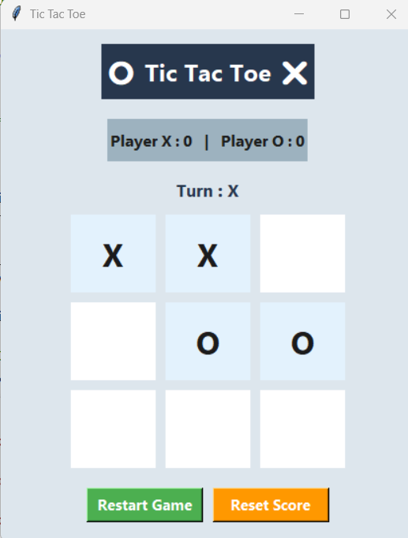

# tic-tac-toe-python
Tic Tac Toe game build with python and tkinter

##Features

-Two-player gameplay
-Graphical user interfrace(tkinter)
-Winner detection
-Restart game

##Screenshots

###Game-Window

###Winner-Detection

##Technologies

-Python
-Tkinter

##About

This project was developed as part of my university coursework and helped me preactice GUI development game logic and event handling using python.
